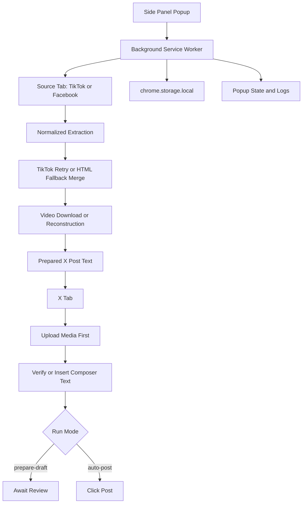

# XgenM Project Map

- Last Updated: 2026-03-23
- Project Type: Chrome Extension (Manifest V3)
- Current Status: Implemented first-pass cross-post workflow, with TikTok as the strongest production path and Facebook Reel as a weaker best-effort path.

## Philosophy

XgenM exists to automate cross-posting short-form videos from TikTok and Facebook Reel to X without using official APIs. The project chooses browser-truth automation over backend complexity: it works through the user's real logged-in Chrome session, extracts from live source pages, and posts through the real X web interface.

The design is intentionally operator-driven. The extension does not try to hide fragility behind a black box. Instead, it exposes phases, logs, previews, and a safer draft mode so the operator can see what the automation is doing and where it fails.

The most important architectural bias in the current implementation is reliability over elegance. In particular, the X flow deliberately uploads media first and verifies composer text after that, because this sequence proved more stable against X's real UI behavior.

## Current State

- The project is beyond planning-only status and already contains a working first-pass implementation.
- `TikTok -> extract -> prepare text -> open X -> upload media -> verify text -> draft/post` is the primary implemented flow.
- Popup UI already works as a side panel with URL input, mode toggle, caption override, preview, status, and logs.
- Background service worker already orchestrates the end-to-end lifecycle with explicit job phases and runtime log broadcasting.
- TikTok extraction is mature relative to the rest of the codebase and includes retries plus HTML fallback logic.
- Facebook Reel extraction exists but is explicitly less reliable and should still be treated as a secondary path.
- Persistence is local-only via `chrome.storage.local`.
- Over 115 unit and component tests exist (using Vitest), covering text parsing, DOM mocks, and phase transitions.

## Key Landmarks

### Runtime Core

- `src/background/index.ts`
  - Service worker entry point.
  - Opens the side panel on extension action click.
  - Routes `START_JOB`, `CANCEL_JOB`, `GET_JOB_STATE`, and diagnostic `LOG` messages.

- `src/background/job-runner.ts`
  - Core orchestration spine of the whole product.
  - Owns job state, log broadcasting, platform detection, extraction retries, TikTok HTML fallback, video download/reconstruction, text preparation, X posting, and final persistence.
  - Contains build marker `2026-03-21-upload-first-v2`, which is a useful runtime anchor.

- `src/background/tab-manager.ts`
  - Handles open-or-focus behavior, load waiting, and retrying `sendMessage` after tab reload if the receiver is missing.

- `src/background/storage.ts`
  - Wraps `chrome.storage.local` for user settings, last job recovery, and capped job history.

### Source Extraction

- `src/content/source/tiktok.ts`
  - Most advanced extraction path in the repo.
  - Uses ranked selectors, caption expansion, visibility heuristics, JSON/script probing, meta fallback, and page-context helpers for blob/object-url recovery.

- `src/content/source/facebook.ts`
  - Best-effort extraction path for Facebook Reel.
  - Structurally more fragile than TikTok because Facebook markup drifts often.

- `src/content/source/page-bridge.ts`
  - Bridge for work that must happen in page context rather than extension context.

### X Automation

- `src/background/x-post-session.ts`
  - The new "Submit-Truth" architecture state machine for X post lifecycle.
  - Evaluates `ComposeEvidence` to handle safety gating (preventing empty text pushes).
  - Drives background triggers and waits for `proof` from content scripts.

- `src/content/x/composer.ts`
  - Orchestrator for decomposed modular behaviors (target, write, proof, submit).
  - Legacy operations were moved into:
    - `composer-target.ts`: DOM scoring and selection.
    - `composer-write.ts`: DataTransfer and KeyboardEvent injections.
    - `composer-proof.ts`: Verifies real text present in the DOM against expectations (the "Truth Contract", Evidence gating).
    - `composer-submit.ts`: Handles validation before actually clicking the post button.

- `src/content/x/upload.ts`
  - Finds the media input or media button.
  - Converts a data URL into a `File` object.
  - Injects media using `DataTransfer`.
  - Waits for upload completion using UI heuristics and Post-button readiness.

- `src/content/x/selectors.ts`
  - Centralized fallback selector families for composer, post button, media input, and upload state.

### Operator Surface

- `src/popup/App.tsx`
  - Main side-panel operator console.
  - Recovers current job state on open.
  - Auto-detects supported active-tab URLs.
  - Starts and cancels jobs.
  - Shows preview, current phase, and log stream.

### Shared Contracts

- `src/shared/types.ts`
  - Canonical contracts for:
    - `SourcePlatform`
    - `RunMode`
    - `JobPhase`
    - `ExtractedSourceData`
    - `PreparedPost`
    - `JobState`
    - `UserSettings`

- `src/shared/text.ts`, `src/shared/url.ts`, `src/shared/timing.ts`, `src/shared/constants.ts`
  - Deterministic shared utilities used by both background and content scripts.

### Build Surface

- `manifest.json`
  - Declares MV3 runtime, side panel, permissions, host permissions, and content scripts for TikTok, Facebook, and X.

- `vite.config.ts`
  - Builds popup and background through Vite.
  - Copies manifest and icon assets into `dist/`.
  - Bundles content scripts separately with esbuild into standalone outputs Chrome can inject directly.

- `doc/current-status-handoff.md`
  - Best operator-facing truth source for what is working now and what should happen next.

## Runtime Data Flow

1. Operator opens the side panel and supplies a TikTok or Facebook Reel URL.
2. Popup sends `START_JOB` to the background service worker.
3. Background detects platform from the URL.
4. Background opens or focuses the source tab.
5. Background waits for the tab to finish loading.
6. Background sends `EXTRACT_SOURCE` to the relevant content script.
7. Source content script returns normalized extraction data.
8. If TikTok data is weak, background retries extraction and may merge HTML-fallback data.
9. Background downloads or reconstructs the video asset.
10. Background prepares final X text using shared text utilities and settings.
11. Background opens X and triggers media upload first.
12. X content script injects the file and waits for upload-complete heuristics.
13. Background then triggers caption composition and verifies expected text.
14. In `prepare-draft` mode, the job stops at `awaiting-review`.
15. In `auto-post` mode, the content script clicks Post and the job completes.
16. During the full run, state and logs are broadcast back to the popup and persisted to local storage.

## Operator Model

The popup is not just a launcher. It is the operator console for a brittle automation system.

- URL entry is manual-first but active-tab detection is available for convenience.
- `prepare-draft` is the safer default mode for runtime truth.
- `auto-post` exists for trusted flows after operator confidence is high enough.
- Caption override gives the operator a direct correction surface when extraction quality is imperfect.
- Logs are first-class because debugging DOM-driven automation without logs is not viable.

## Persistence Model

The extension is local-first.

- `chrome.storage.local` stores:
  - `settings`
  - `last job`
  - `job history`
- History is capped at 50 entries.
- There is no backend, queue, remote cache, or server-side database.

This keeps the system simple and private, but it also means observability and recovery are limited to the current browser environment.

## Build And Packaging

- `npm run build` runs `tsc && vite build`.
- Popup and background are emitted through Vite/Rollup.
- Manifest and icons are copied into `dist/` after the build.
- Content scripts are bundled separately through esbuild as standalone files:
  - `content-tiktok.js`
  - `content-facebook.js`
  - `content-x.js`

This dual-pipeline build is a key architectural fact. If a runtime issue appears only in a content script, debugging must include the esbuild output path, not just the main Vite bundle.

## Contracts And Domain Language

- Supported source platforms: `tiktok`, `facebook`
- Run modes: `prepare-draft`, `auto-post`
- Ordered phases:
  - `idle`
  - `opening-source`
  - `extracting`
  - `downloading-video`
  - `opening-x`
  - `filling-composer`
  - `uploading-media`
  - `awaiting-review`
  - `posting`
  - `completed`
  - `failed`

Settings already anticipate future UX work even though the full settings UI is not built yet:

- default mode
- include source credit
- maximum hashtags
- caption template

## Challenges

### 1. DOM Drift

The dominant risk across TikTok, Facebook, and X is third-party DOM drift. This project depends on real markup, real contenteditable surfaces, real file inputs, and platform-specific loading behavior.

### 2. X Upload Heuristics

Upload success is inferred from UI heuristics and button readiness, not from a stable API contract. This can silently break when X changes attachment UI.

### 3. TikTok Hydration Gaps

TikTok caption or media truth may not be immediately available because of SPA hydration timing. That is why retries and HTML fallback already exist.

### 4. Facebook Fragility

Facebook Reel extraction is materially weaker than TikTok and should not be treated as equivalent until hardened with broader selector families and richer page-state probing.

### 5. Extension Memory And File Constraints

Large videos, blob recovery, and data URL conversion can be memory-heavy in extension context.

### 6. Maturing Automated Regression Net

We now have 115+ automated Vitest tests. However, end-to-end integration and DOM interaction for third-party websites (Facebook, TikTok, X) are inherently brittle. This means manual live validation is still required for the highest confidence in full extraction/posting flows.

## Next Work

1. Add a manual regression checklist for:
   - TikTok draft flow
   - X upload flow
   - selector drift diagnostics
2. Harden Facebook Reel extraction with broader selectors and richer fallback strategies.
3. Expose a settings UI for source credit, hashtag cap, default mode, and caption template.
4. Add deterministic tests around shared logic such as URL detection, text building, hashtag extraction, and truncation.
5. Add clearer operator-facing failure messages when X composer or upload selectors drift.

## Mermaid Overview

